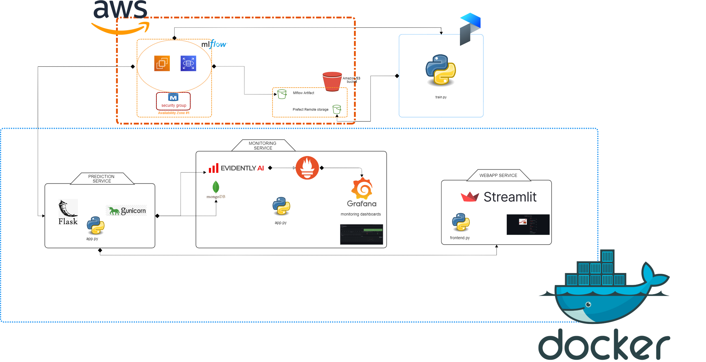
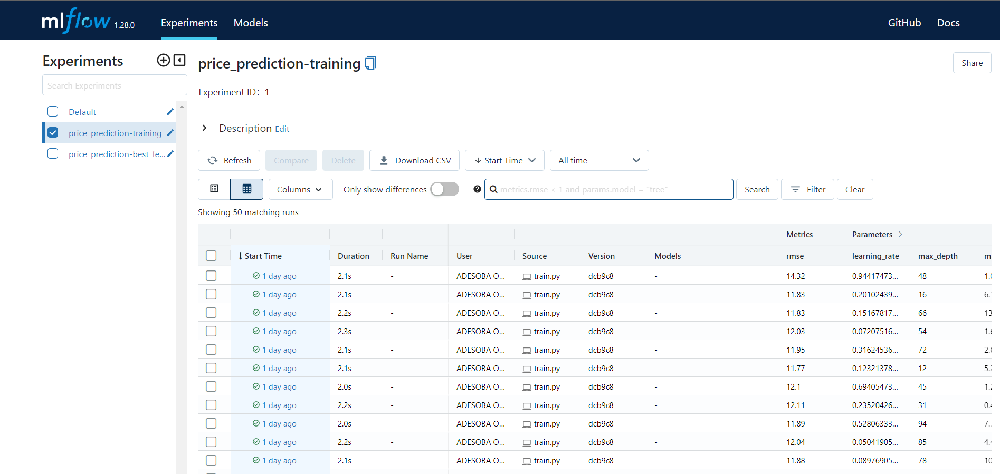
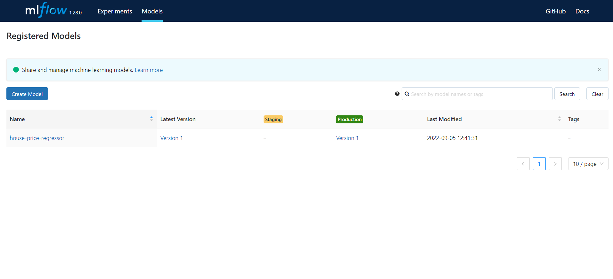
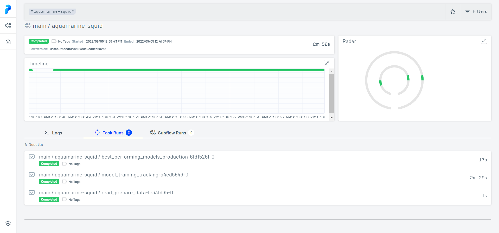
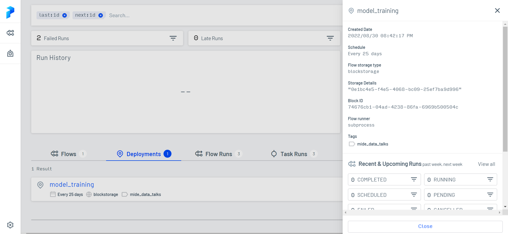
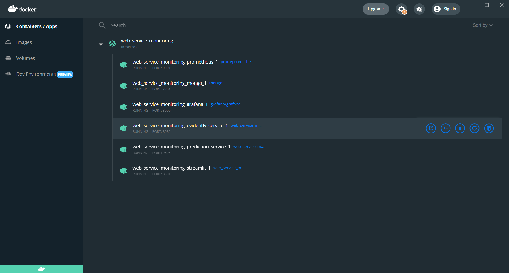
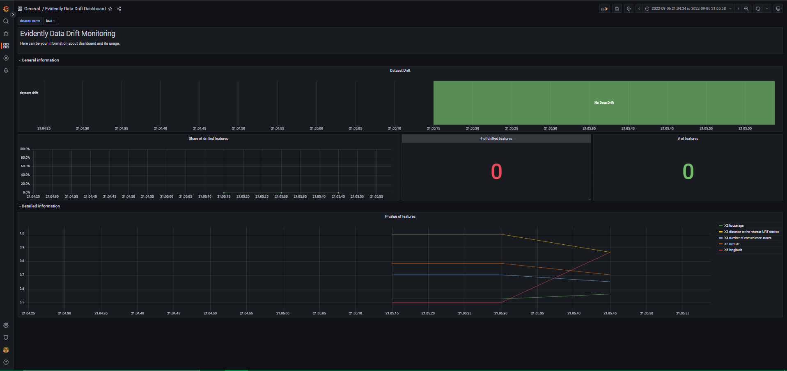
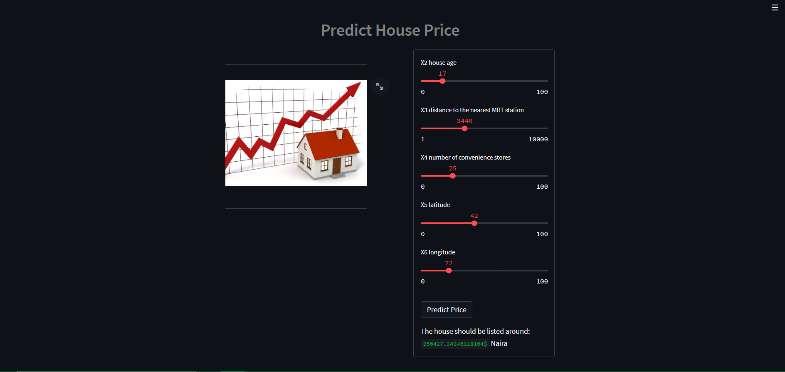

# Capstone Project (Mlops-Zoomcamp) - House Price Prediction


## Problem Statement

This is a capstone project associated with [MLOps Zoomcamp](https://github.com/DataTalksClub/mlops-zoomcamp), and it will be peer reviewed and scored.

The end goal of the project is to build an end-to-end machine learning project containing feature engineering, trainig, vallidation,tracking, modeel deployment,hosting and general engineering best practices aimed at making house price prediction.


## Dataset

This  data set has 414 rows and 7 columns. 
It provides the market historical data set of real estate valuations which are collected from Sindian Dist., New Taipei City, Taiwan.
This data set is recommended for learning and practicing your skills in **exploratory data analysis**, **data visualization**, and **regression modelling techniques**. 
Feel free to explore the data set with multiple **supervised** and **unsupervised** learning techniques. 
The Following data dictionary gives more details on this data set:

---

### Data Dictionary 

| Column   Position 	| Atrribute Name                         	| Definition                                                                                                                                                                 	| Data Type    	| Example                         	| % Null Ratios 	|
|-------------------	|----------------------------------------	|----------------------------------------------------------------------------------------------------------------------------------------------------------------------------	|--------------	|---------------------------------	|---------------	|
| 1                 	| X1 transaction date                    	| The   transaction date (for example, 2013.250=2013 March, 2013.500=2013 June, etc.)                                                                                        	| Qualitative  	| 2013.500,   2013.500, 2013.333  	| 0             	|
| 2                 	| X2 house age                           	| The house age   (unit: year)                                                                                                                                               	| Quantitative 	| 19.5, 13.3, 5.0                 	| 0             	|
| 3                 	| X3 distance to the nearest MRT station 	| The distance   to the nearest MRT station (unit: meter)                                                                                                                    	| Quantitative 	| 390.5684, 405.21340, 23.38284   	| 0             	|
| 4                 	| X4 number of convenience stores        	| The number of   convenience stores in the living circle on foot                                                                                                            	| Quantitative 	| 6, 8, 1                         	| 0             	|
| 5                 	| X5 latitude                            	| The geographic   coordinate, latitude (unit: degree)                                                                                                                       	| Quantitative 	| 24.97937,   24.97544, 24.94925  	| 0             	|
| 6                 	| X6 longtitude                          	| The geographic   coordinate, longitude (unit: degree)                                                                                                                      	| Quantitative 	| 121.54243, 121.49587, 121.51151	 	| 0             	|
| 7                 	| Y house price of unit area             	| The house price of unit   area (10000 New Taiwan Dollar/Ping, where Ping is a local unit, 1 Ping = 3.3   meter squared) for example, 29.3 = 293,000 New Taiwan Dollar/Ping 	| Quantitative 	| 29.3, 33.6, 47.7


## Design & flow architecture

The architecture below  depicts the system design:



Language, frameworks, libraries, Services and Tools used to bootstrap this project.

* 
* 
* 
*  : Container
*  : Prediction service (web app)
* 
*  : s3 for storage,RDS as database, EC2 as virtual machine
* <a href='https://mlflow.org/images/MLflow-logo-final-white-TM.png' target="_blank"></a> : Experiment tracking and model registry
* <a href='https://cdn.worldvectorlogo.com/logos/prefect-1.svg' target="_blank"></a>: Workflow orchestration
* <a href='https://cdn.worldvectorlogo.com/logos/prefect-1.svg' target="_blank"></a> : open source app framework in Python language
* <a href='' target="_blank"></a> : Monitoring
* <a href='' target="_blank"></a> : Monitoring Dashboard
* <a href='' target="_blank"></a> : Monitoring Database
* 
* 
* 
* 
* Pylint + Black + isort : Linter and code formaters


## Flow

- [x] Training , orchestration, Tracking, Model Registry & Deployment
```bash
make train
```





- [x] Prediction service setup , Monitoring service setup, Integratin Test, Streamlit provisioning
```bash
make build
```


- [x] Batch Prediction
```bash
python stream_send.py
```


- [x] Prediction
```bash
[http:](http://localhost:8501)
```



## Project Tree Structure

The following is the resulting repo structure:

```bash 
|-- Makefile                                                                                              
|-- README.md
|-- Test
|   `-- integration_test
|       `-- run.sh
|-- Tracking_Orchestration
|   |-- Pipfile
|   |-- Pipfile.lock
|   |-- test.py
|   |-- track.sh
|   `-- train.py
|-- data
|   |-- batch_test.csv
|   |-- data.xlsx
|   `-- train.csv
|-- images
|   |-- MLFLOW_EXPER.PNG
|   |-- deploy.PNG
|   |-- docker.PNG
|   |-- drift.PNG
|   |-- mlflow_model.PNG
|   |-- train.PNG
|   `-- web_page_STREAMLIT.PNG
|-- pyproject.toml
|-- streamlit
|   |-- Dockerfile
|   |-- Pipfile
|   |-- Pipfile.lock
|   |-- frontend.py
|   `-- images
|       `-- house.jpg
`-- web_service_monitoring
    |-- Pipfile
    |-- Pipfile.lock
    |-- docker-compose.yml
    |-- evidently_service
    |   |-- Dockerfile
    |   |-- app.py
    |   |-- config
    |   |   |-- grafana_dashboards.yaml
    |   |   |-- grafana_datasources.yaml
    |   |   `-- prometheus.yml
    |   |-- config.yaml
    |   |-- dashboards
    |   |   |-- cat_target_drift.json
    |   |   |-- classification_performance.json
    |   |   |-- data_drift.json
    |   |   |-- num_target_drift.json
    |   |   `-- regression_performance.json
    |   |-- datasets
    |   |   `-- train.csv
    |   `-- requirements.txt
    |-- prediction_service
    |   |-- Dockerfile
    |   |-- app.py
    |   `-- requirements.txt
    |-- requirements.txt
    |-- stream_send.py
    `-- test.py

   13 directories, 46 files 

```

<!-- ACKNOWLEDGMENTS -->
## Acknowledgments

I am extremely grateful for the time this set of wonderful people put in place to ensure we understood the various aspect of data and analytical engineering

* [Alexey Grigorev](https://www.linkedin.com/in/agrigorev/)
* [Kevin Kho](https://www.linkedin.com/in/kvnkho/)
* [Ankush Khanna](https://www.linkedin.com/in/ankushkhanna2/)
* [Sejal Vaidya](https://www.linkedin.com/in/vaidyasejal/)
* [Victoria Perez Mola](https://www.linkedin.com/in/victoriaperezmola/)

